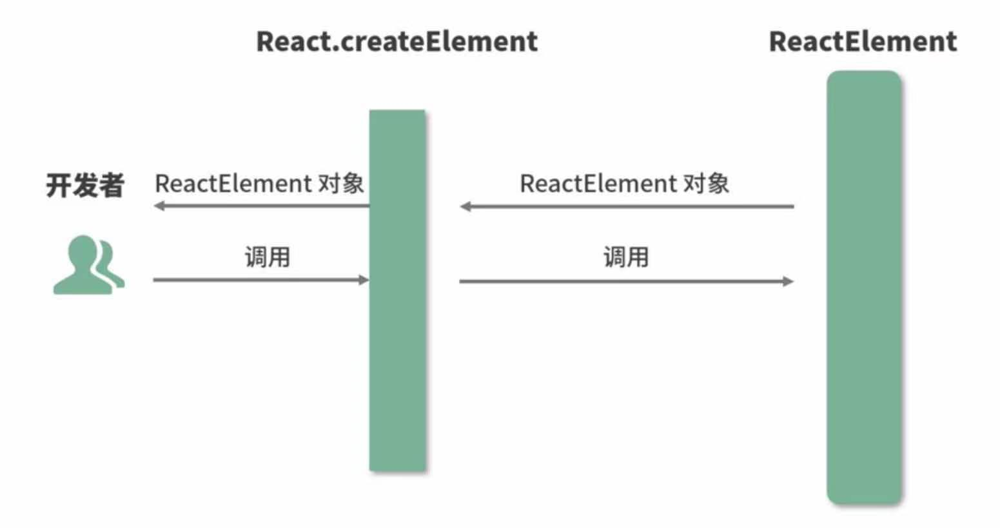
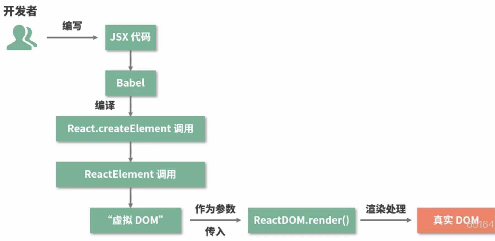

import useBaseUrl from "@docusaurus/useBaseUrl";

## JSX 的本质是什么，它和 JS 之间有什么关系？

JSX 可以理解为一中特殊的 JS 语法扩展，它主要用于声明 React 元素，在编译阶段时，JSX 会被 Babel 通过`@babel/plugin-transform-react-jsx`插件将 JSX 编译为 js 语法，产生一个函数`React.createElement()`，`React.createElement()`调用后将会返回一个叫做 `React Element` 的 JS 对象。[尝试一下](https://babeljs.cn/repl/#?presets=react&code_lz=DwCwjABAxgNghgZwQOTgWwKYF4BEIMwwD2OAfABIHEQDqRATgCbAD04pQA)

## React 为什么要用 JSX？JSX 能在开发中产生什么样的作用？

因为 JSX 类似于 HTML 语法，写法上比 Javascript 写法更简洁，降低学习成本的同时提高开发效率与开发体验。

```jsx live
<div>
  <p>Javascript</p>
  <p>React</p>
</div>
```

## JSX 背后的功能实现是什么，这些实现都做了那些事情？

通过`React.createElement`将传递的参数格式化成`ReactElement`所需要的参数，它的作用类似与一个适配器，然后`ReactElement`会按照一定的规范将这些参数组装成一个`Element对象`，并将这个`Element`返回给`createElement`，，然后在供开发者使用，这个组装好的`Element`对象其实就是`虚拟DOM`。可通过查看 React 源码来了解其过程。

```jsx
/*
 * createElement 伪代码实现
 **/
function createElement(type, config, children) {
  var propName;
  var props = {};
  var key = null;
  var ref = null;
  var self = null;
  var source = null;

  // TODO 格式化成ReactElement所需要的参数

  return ReactElement(
    type,
    key,
    ref,
    self,
    source,
    ReactCurrentOwner.current,
    props
  );
}
/*
* ReactElement伪代码是实现
**/
function ReactElement(type, key, ref, self, source, owner, props) {
  var element = {
    $$typeof: REACT_ELEMENT_TYPE,
    type: type,
    key: key,
    ref: ref,
    props: props,
    _owner: owner,
  };

  // TODO 组装参数成element对象

  return element;
}
```


```jsx live
function HelloWord() {
    return <h3>HelloWord</h3>;
}
```
*打开浏览器控制台查看log输出*

## JSX到生成页面真实DOM节点的过程是什么样的？

