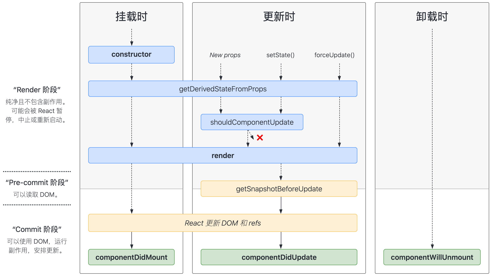
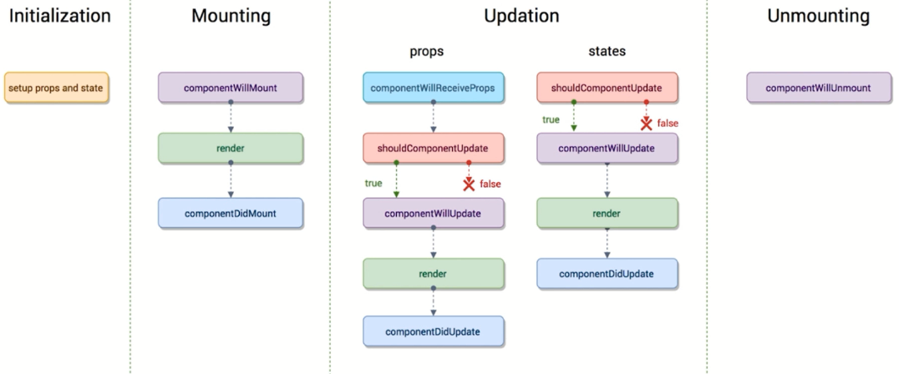
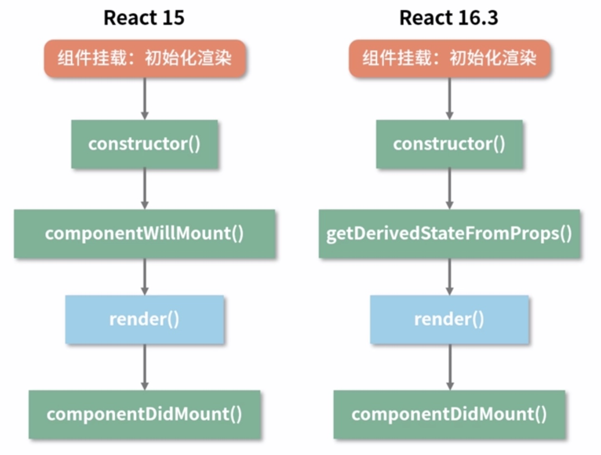
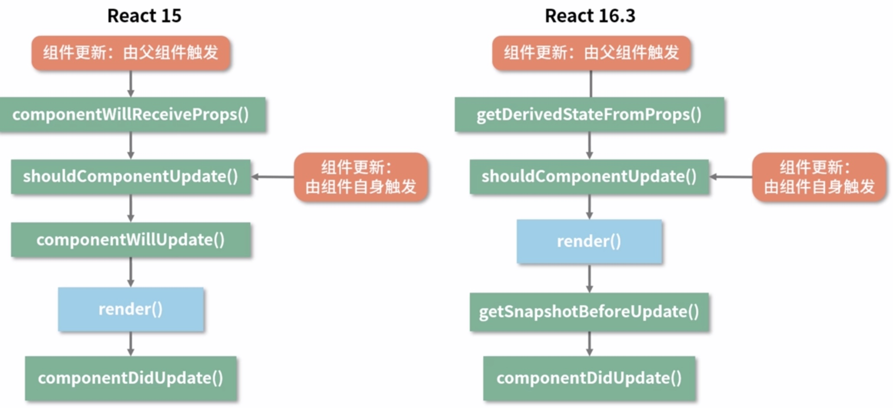

import Tabs from "@theme/Tabs";
import TabItem from "@theme/TabItem";
import useBaseUrl from "@docusaurus/useBaseUrl";

## 什么是类组件？

- 通过 [ES6 class](https://es6.ruanyifeng.com/#docs/class) 语法定义
- 继承自[React.Component](https://zh-hans.reactjs.org/docs/react-component.html)、[React.PurComponent](https://zh-hans.reactjs.org/docs/react-api.html#reactpurecomponent)
- 每个组件都有自己内部的 `State`
- 具有完整的各阶段的[生命周期](https://react.docschina.org/docs/react-component.html#the-component-lifecycle)函数
- 采用面向对象的思想来编写组件，具备类的所有属性

## 一个简单的时钟类组件案例

```jsx live
class Clock extends React.Component {
  constructor(props) {
    super(props);
    this.state = { date: new Date() };
  }

  componentDidMount() {
    this.timerID = setInterval(() => this.tick(), 1000);
  }

  componentWillUnmount() {
    clearInterval(this.timerID);
  }

  tick() {
    this.setState({
      date: new Date(),
    });
  }

  render() {
    return (
      <div>
        <h2>It is {this.state.date.toLocaleTimeString()}.</h2>
      </div>
    );
  }
}
```

## React16 生命周期

此图出自于开源项目：[React 生命周期图谱](https://projects.wojtekmaj.pl/react-lifecycle-methods-diagram/)



请运行以下案例：

<Tabs
  defaultValue="father"
  values={[
    { label: '父组件', value: 'father', },
    { label: '子组件', value: 'child', }
  ]}
>
<TabItem value="father">

```jsx title="/src/components/FatherComponent.js"
import React from "react";
import ChildComponent from "./ChildComponent";

export default class FatherComponent extends React.Component {
  state = {
    fatherText: "来自父组件的文本",
    fatherOwnerText: "父组件自己的文本",
    showChild: true,
  };

  // 修改父组件传递给子组件的文本
  changeFatherText = () => {
    this.setState({
      fatherText: "来自父组件的文本：已修改",
    });
  };

  // 修改父组件自己的文本
  changeFatherOwnerText = () => {
    this.setState({
      fatherOwnerText: "父组件自己的文本：已修改",
    });
  };

  // 更改子组件状态
  changeChildStatus = () => {
    this.setState({
      showChild: !this.state.showChild,
    });
  };

  render() {
    const { fatherText, fatherOwnerText, showChild } = this.state;
    return (
      <div>
        <div>
          <button onClick={this.changeChildStatus}>
            {showChild ? "卸载" : "挂载"}子组件
          </button>
          <button onClick={this.changeFatherOwnerText}>
            更改fatherOwnerText
          </button>
          <button onClick={this.changeFatherText}>更改fatherText</button>
          {showChild ? <ChildComponent text={fatherText} /> : null}
          <p>fatherOwnerText: {fatherOwnerText}</p>
        </div>
      </div>
    );
  }
}
```

</TabItem>
<TabItem value="child">

```jsx title="/src/components/ChildComponent.js"
import React from "react";

export default class ChildComponent extends React.Component {
  // 初始化state
  state = {
    childText: "来自子组件的文本",
  };

  // 更改子组件文本
  changeChildText = () => {
    this.setState({
      childText: "来自子组件的文本：已修改",
    });
  };

  /**
   * getDerivedStateFromProps
   * 会在调用 render 方法之前调用，
   * 并且在初始挂载及后续更新时都会被调用。
   * 它应返回一个对象来更新 state，
   * 如果返回 null 则不更新任何内容。
   * 当有需要从props中派生出state的时候可以用到此函数，
   * 一般不常用
   */
  static getDerivedStateFromProps(props, state) {
    console.log("getDerivedStateFromProps：用来从props派生state");
    return null;
  }

  /**
   * render
   * 用来生成虚拟DOM结构，
   * 当不需要生成DOM结构时可以返回null
   *
   * 此函数应该为纯函数，
   * 这意味着在不修改组件state的情况下，
   * 每次调用时都返回相同的结果，
   * 并且它不会直接与浏览器交互。
   */
  render() {
    return (
      <>
        <button onClick={this.changeChildText}>更改childText</button>
        <p>fatherText: {this.props.text}</p>
        <p>childText :{this.state.childText}</p>
      </>
    );
  }

  /**
   * componentDidMount
   * 组件已挂载到真实DOM
   * 一般会在此处发起后台请求
   * 获取接口数据数据
   */
  componentDidMount() {
    console.log("componentDidMount：组件已挂载");
  }

  /**
   * shouldComponentUpdate
   * 是否更新组件，用来优化性能
   * 当组件发生更新（props 或 state 发生变化时）时会调用此函数
   * 可以通过返回 true/false 来控制组件是否重新渲染（运行render函数）
   */
  shouldComponentUpdate() {
    console.log("shouldComponentUpdate：组件是否要更新");
    return true;
  }

  /**
   * getSnapshotBeforeUpdate
   * 在最近一次渲染输出（提交到 DOM 节点）之前调用。
   * 它使得组件能在发生更改之前从 DOM 中捕获一些信息（例如，滚动位置）。
   * 此生命周期的任何返回值将作为参数传递给 componentDidUpdate。
   */
  getSnapshotBeforeUpdate() {
    console.log("getSnapshotBeforeUpdate：最近一次渲染输出之前");
    return null;
  }

  /**
   * componentDidUpdate
   * 会在更新后会被立即调用，
   * 可以在此函数中获取到当前页面最新的DOM节点
   */
  componentDidUpdate() {
    console.log("componentDidUpdate：组件已更新");
  }

  /**
   * componentWillUnmount
   * 会在组件卸载及销毁之前直接调用。
   * 在此方法中执行必要的清理操作，
   * 例如，清除定时器，取消网络请求或清除在 componentDidMount 中创建的订阅等
   */
  componentWillUnmount() {
    console.log("componentWillUnmount：组件将要卸载");
  }
}
```

</TabItem>
</Tabs>

## React15 生命周期

因为官方已经有了`React16`版本，这里对`React15`只做了解，目的是解释为什么要变更生命周期



```jsx
/**
 * 组件挂载时生命周期
 */
class ReactLifecycle extends React.components {
  // 组件将要挂载时（已弃用）
  componentWillMount() {}
  // 组件渲染时
  render() {}
  // 组件已挂载DOM时
  componentDidMount() {}
  // 父组件发生重新渲染时（已弃用）
  componentWillReceiveProps() {}
  // 组件将要更新时（已弃用）
  componentWillUpdate() {}
  // 是否要更新组件
  shouldComponentUpdate() {}
  // 组件已更新时
  componentDidUpdate() {}
  // 组件将要卸载时
  componentWillUnmount() {}
}
```

## 生命周期对比

### 挂载阶段



### 更新阶段



## 为什么要改变生命周期？

> 有问题，不完美才要改

### React15 与 React16 对比图

[React15 Stack Reconciler VS React16 Fiber Reconciler](!https://claudiopro.github.io/react-fiber-vs-stack-demo/)

### React15 带来的性能问题

在页面元素很多，且需要频繁刷新的场景下，React 15 会出现掉帧的现象，其根本原因，是大量的同步计算任务阻塞了浏览器的 UI 渲染。

默认情况下，JS 运算、页面布局和页面绘制都是运行在浏览器的主线程当中，他们之间是互斥的关系。如果 JS 运算持续占用主线程，页面就没法得到及时的更新。

当我们调用 setState 更新页面的时候，React 会遍历应用的所有节点，计算出差异，然后再更新 UI。整个过程是一气呵成，不能被打断的。如果页面元素很多，整个过程占用的时机就可能超过 16 毫秒，就容易出现掉帧的现象。

针对这一问题，React 团队从框架层面对 web 页面的运行机制做了优化，得到很好的效果。

### React16 的解题思路

解决主线程长时间被 JS 运算占用这一问题的基本思路，是将运算切割为多个步骤，分批完成。也就是说在完成一部分任务之后，将控制权交回给浏览器，让浏览器有时间进行页面的渲染。等浏览器忙完之后，再继续之前未完成的任务。这种解题思路 React 称之为 Fiber。

旧版 React 通过递归的方式进行渲染，使用的是 JS 引擎自身的函数调用栈，它会一直执行到栈空为止。而 Fiber 实现了自己的组件调用栈，它以链表的形式遍历组件树，可以灵活的暂停、继续和丢弃执行的任务。实现方式是使用了浏览器的 [requestIdleCallback](https://developer.mozilla.org/zh-CN/docs/Web/API/Window/requestIdleCallback)这一 API。官方的解释是这样的：

> window.requestIdleCallback()方法将在浏览器的空闲时段内调用的函数排队。这使开发者能够在主事件循环上执行后台和低优先级工作，而不会影响延迟关键事件，如动画和输入响应。函数一般会按先进先调用的顺序执行，然而，如果回调函数指定了执行超时时间 timeout，则有可能为了在超时前执行函数而打乱执行顺序。

Fiber 具体实现思路可参考此文章[此文章](https://segmentfault.com/a/1190000018250127)。

### 总结

React16 之所以要改变生命周期，是因为 React15 具有性能瓶颈，因此 React16 采用了 Fiber Reconciler，正式由于采用了这种架构在 Reconciler 阶段会重复执行，导致此阶段的生命周期函数会重复调用，所以在 React16 中采用了新的生命周期结构。
